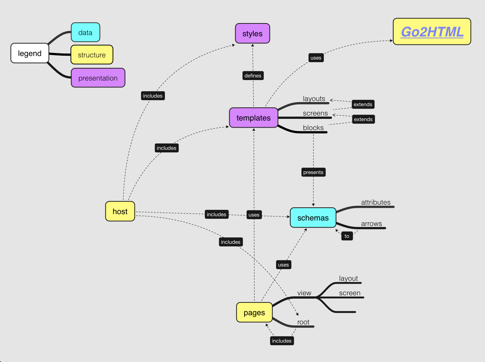

# spg - static pages generator

## Purpose
Static pages generating DSL.

## Glossary
- **Host**
- **PageGenerator**
- **Schema**

## Model

## Usage

## Conventions

## Best Practices

## Limitations
